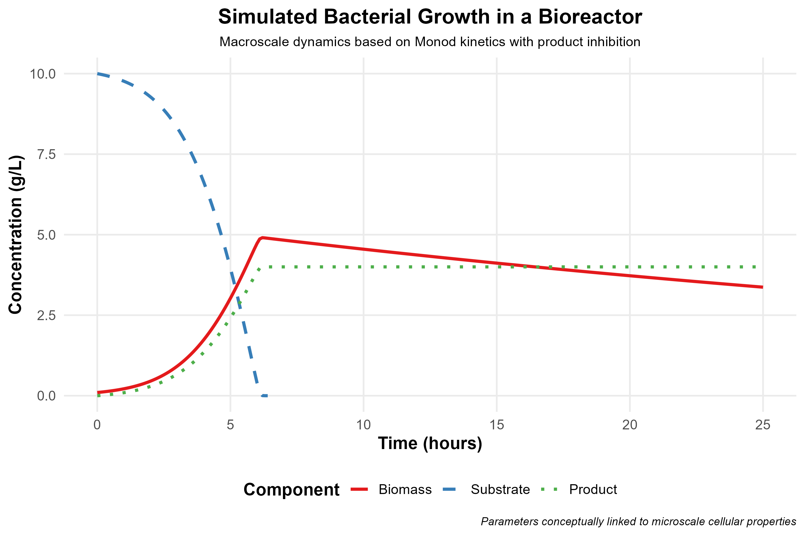

# Biomedical Modeling

A repo containing code for basic biological models and visualizatons.

***NOTE: The models are generated with the assistance of GenAI coding assistant tools.***

## Example Models

### 1. Lotka-Volterra model

The classic Lotka-Volterra model (also known as the predator-prey model) describes the dynamic interactions between predators and their prey. It is described by a pair of nonlinear differential equations, and the model assumes that the prey consumption rate by a predator is directly proportional to the prey abundance.

Link: [Lotka-Volterra on Wikipedia](https://en.wikipedia.org/wiki/Lotka-Volterra_equations)

### 2. Bacterial Growth in a Bioreactor

Here we look at bacterial growth in a bioreactor. The Monod equation is used to describe the growth of microorganisms, and the model output demonstrates the biomass, substrate, and product concentrations.

Link: [Bacterial Growth on Wikipedia](https://en.wikipedia.org/wiki/Monod_equation)

### 3. Pharmaceutical Research

Physiologically based pharmacokinetic (PBPK) modeling for predicting the absorption, distribution, metabolism, and excretion (ADME) of the drug labetalol in pregnant women. This is a multicompartment model that incorporates various organs, tissues, and vascular fluid flows.

Link: [PBPK on Wikipedia](https://en.wikipedia.org/wiki/Physiologically_based_pharmacokinetic_modelling)

### 4. Heart Rate and Exercise

A model of the heart rate responses to exercise for individuals of different fitness levels. The heart rate is shown for various exercise phases including warm-up, increasing intensity, peak exercise, and cool down.

### 5. Blood Glucose Responses after Meal Consumption

A model of blood glucose responses to meals of different glycemic indexes. Meal types influence which glucose zone the individual reaches.

### 6. Tumor growth, angiogenesis, and chemotherapy

A model of tumor growth and its response to chemotherapy. The model also incorporates aspects of angiogenesis, VEGF, and hypoxia.

### 7. Distance Running

Multiscale model of a runner that incorporates both training load and physiological metrics. The model provides one with a theoretical prediction of the effects of training on physiological metrics.

